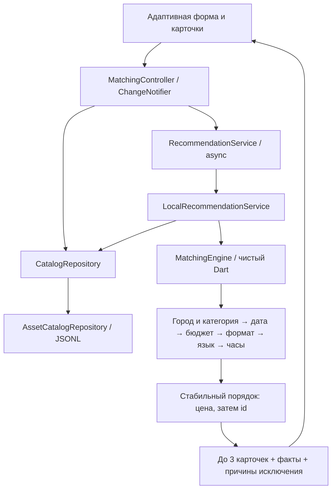

# Архитектура Event Match

Статус: стартовый работающий каркас для хакатона #79-lite, не финальное AI-решение. Firebase SDK подключён к `hackalem-84547` для Web и Android; сервер и GPT ещё не развёрнуты. Текущий статус и блокер биллинга — в [firebase.md](firebase.md).

## Границы

Одна Flutter-кодовая база: web, Android, iOS. При входе — каталог с заполненными карточками (по 12, с кнопкой загрузки следующих). После применения условий — отдельная подборка до трёх рекомендаций. Просмотр каталога не обещает доступность на дату. Никаких бронирований, кабинетов и уведомлений в MVP.

`domain` не импортирует Flutter. `data` отвечает за источник и преобразование JSONL. `presentation` содержит состояние загрузки/ошибки/результата и виджеты. `app` собирает зависимости, локализацию и тему. Ручная передача зависимостей и ChangeNotifier достаточны для одного сценария; Riverpod/BLoC и роутер пока не нужны.

## Правила первого этапа

- Город и категория определяют исходный пул. Пустой пул — `categoryAbsent`.
- Дата, бюджет, формат и заданные язык/длительность — жёсткие ограничения. Пустая выдача после них — `noEligible`.
- `max_hours: null` означает отсутствие привязки к часам, а не ноль.
- Счётчики исключения используют первую причину в указанном порядке; сумма не считает одного человека дважды.
- `matched` содержит максимум 3 рекомендации. Если их меньше, поясняем размер каталога или причины исключения.
- Стартовая цена не обещает итоговую стоимость. Восстановленные город/цена и синтетические записи отмечены.
- Порядок пока по цене, при равенстве — по id. Это прозрачный baseline, не семантический AI-рейтинг.
- Объяснение использует только проверенные поля и явно цитирует описание. Смысловой анализ описания ещё не реализован.
- Изменение условий очищает старые результаты. Календарь ограничен окном датасета.

## Данные

Рабочий источник — 66 профилей организаторов в `assets/data/catalog.jsonl`, преобразованные из неизменённой копии `data/catalog.csv` скриптом `scripts/import_catalog.py`. Списки в CSV разделены `|`, пустые часы преобразуются в null, строковые флаги — в bool. Импорт проверяет уникальность id, обязательные поля, цены, часы и окно дат. В исходных данных 13 синтетических профилей — помечаем их как синтетику организаторов. Категории формы дополняются из каталога. Собственные 6 профилей `demo.jsonl` используются только как изолированные тестовые фикстуры.

## Следующий этап: AI и сервер

При подключении LLM добавляем серверный API на Firebase Cloud Functions (callable). Ключи хранятся только на сервере. Контракт: поля MatchRequest → outcome, recommendations, summary, версия датасета и алгоритма. UI уже получает ответ через интерфейс RecommendationService; текущий engine остаётся эталонным fallback и тестовым oracle для фильтров. Пожелания передаются отдельным полем preferences; локальная реализация их пока не анализирует. Подробности подключения — в [firebase.md](firebase.md).

Сервер сначала жёстко фильтрует записи, затем ранжирует по фиксированной формуле и id. Семантические признаки/эмбеддинги можно предварительно вычислить для 66 профилей. LLM получает только отобранные факты и помогает сформулировать индивидуальное объяснение; он не меняет доступность, цену и порядок. Кэш по нормализованному запросу + версии данных/алгоритма/модели; таймаут и фактическое шаблонное объяснение при сбое. Temperature=0 само по себе не гарантирует детерминизм.

Это план расширения: сервера, API, эмбеддингов и LLM сейчас в репозитории нет.

## Адаптивность

Карточки располагаются в 1–3 колонки по доступной ширине: от 700 — две, от 1120 — три. При крупном системном тексте — одна колонка. Фильтры открываются кнопкой над каталогом: на широком экране в правой модальной панели, на телефоне (до 700) — в полноэкранном диалоге. Применение возвращает MatchRequest и закрывает форму; закрытие без применения отбрасывает черновик. Выбранные условия остаются над выдачей, сброс возвращает каталог. Форма OrderFilters и ContractorCard вынесены в presentation/widgets. Material 3, SafeArea, русские системные диалоги, доступные кнопки. Светлая тема; тёмная пока не заявлена.

Минималистичный стиль и LayoutBuilder выбраны с помощью ui-ux-pro-max. Маркетинговый лендинг и отзывы не подходят задаче: главный экран сразу начинает подбор.

Архитектурные ориентиры: https://docs.flutter.dev/app-architecture/guide и https://docs.flutter.dev/ui/adaptive-responsive/general.
