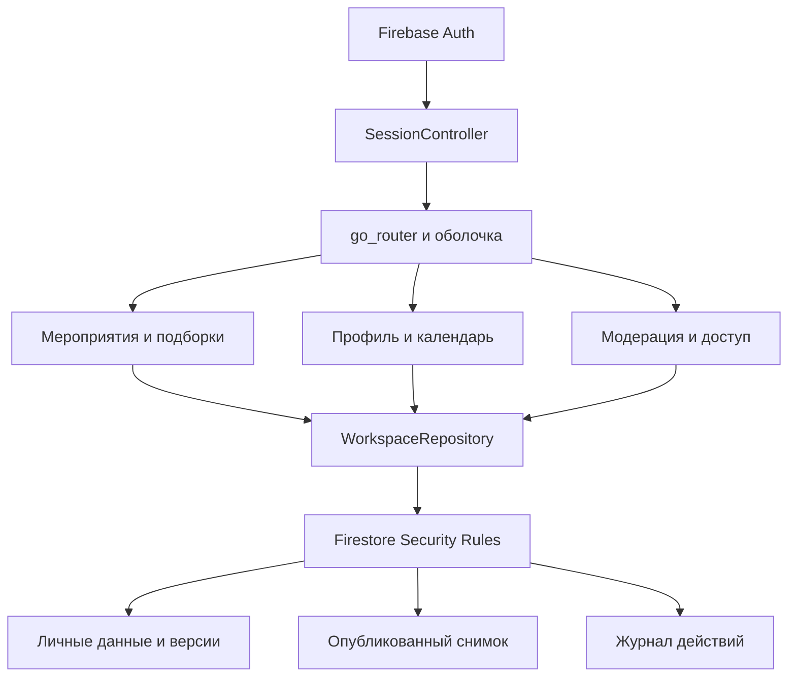

# Архитектура Event Match

Flutter Web/Android, слои `domain/data/presentation`, ручная передача зависимостей и `ChangeNotifier`. `go_router` разделяет публичный каталог, демо, вход и кабинеты. Production создаёт `SessionController` и `FirestoreWorkspaceRepository`; существующий `EventMatchApp(repository:)` сохранён для изолированных тестов демо.

## Авторизация и хранение

Один UID может быть заказчиком и владельцем одной карточки. Служебная роль хранится в `staffAccess`; Rules проверяют текущую роль и состояние аккаунта. Анонимный Firebase Auth для демопомощника считается гостем и не создаёт пользовательский профиль.

Черновик и опубликованная карточка — разные документы. Отправленная версия заморожена; решение модератора привязано к ревизии. Публикация и аудит атомарны. Календарь не копируется при модерации. Блокировка/деактивация скрывает карточку в той же транзакции; восстановление не публикует её снова. Сотрудник не проверяет свой профиль. Личные мероприятия недоступны сотрудникам через приложение.

Приватные страницы очищаются при смене UID, выходе и утрате доступа. Firestore disk persistence отключён; рабочие списки читаются с сервера. Ошибка backend не переключает приложение на fixtures. [Схема, Rules, удаление и bootstrap](accounts-backend.md).

## Подбор

`Contractor` содержит только публичные данные. `WorkspaceCatalogRepository` читает опубликованные снимки. `LiveRecommendationService` получает календарь нужного месяца, проверяет 30-дневную свежесть и передаёт `available/busy/unconfirmed` в чистый `MatchingEngine`.

`MatchDatePolicy.demo()` сохраняет окно 23.09–31.12.2026. Live использует сегодняшний календарный день Казахстана и горизонт 365 дней. Даты передаются строкой `YYYY-MM-DD`, без преобразования даты события в UTC. Часы сервиса внедряются для тестов.

Фильтры: город и категория → подтверждённая доступность → бюджет → формат → язык → часы. В сводке одна первая причина исключения на профиль. Сортировка по цене, затем ID; максимум три карточки. Сохранены `categoryAbsent`, `noEligible`, `matched`. Неподтверждённый календарь и занятость объясняются отдельно.

Сохранённая подборка — исторический снимок запроса, карточек и объяснений. При открытии сверяются цена, публикация и доступность. Обновление использует текущие условия мероприятия и требует явного сохранения результата. Избранное показывает актуальную карточку или сообщение о снятой публикации.

## Отдельные режимы

- `/demo` использует неизменённый JSONL и прежний локальный сервис. Анкетам не создаются аккаунты; живое избранное для них недоступно.
- `/assistant` работает отдельно с демонстрационным набором; [его серверные требования](assistant.md) независимы от Spark-кабинетов.
- Кабинетам не нужны Functions, Storage или LLM. Публичный деловой контакт вводится отдельно от email входа.
- В первом релизе один владелец события и карточки. Командные приглашения, бронь, платежи и iOS Firebase не включены. Заявки и переписка реализованы отдельным модулем.

Локальные тесты проверяют реализацию, но не доказывают развёртывание в `hackalem-84547`. [Статус подключения](firebase.md).

## Коммуникация

`CommunicationRepository` и `FirestoreCommunicationRepository` связывают заявки с Firebase UID реального подрядчика и снимком `ClientEvent`. Первая запись и сообщения атомарно обновляют заголовок диалога; сервер проверяет автора, участников и переходы статусов. Поддержка получает контекст только по явному обращению после назначения администратора; действия сопровождаются аудитом. Одно текущее разрешение отзывается при закрытии или новом связанном обращении.

Все приватные потоки коммуникаций отдают только подтверждённые сервером данные: общий in-memory кеш Firestore не показывается после смены аккаунта или отзыва доступа. UI очищается по UID/epoch. Отдельные Chrome-тесты проверяют настоящий Dart SDK и смену пользователя в одном FirebaseApp. [Схема и воспроизведение проверок](communications.md).
