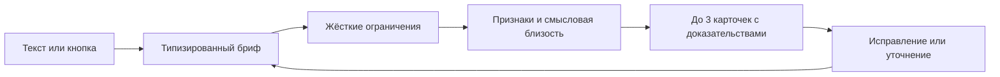

# Помощник Event Match

Помощник — отдельный раздел `/assistant` рядом с демокаталогом. Он работает только с 66 анкетами организаторов. Опубликованные профили из живого каталога аккаунтов сюда не подмешиваются. Бронирование и обращения подрядчикам не выполняются.

## Сценарий

Опишите специалиста, событие, город, дату, бюджет и пожелания одной фразой. Помощник извлекает все сообщённые условия, показывает редактируемое «Уже учтено» и спрашивает только недостающее. Когда известны город, категория и формат, доступна предварительная подборка. Неизвестные дата/бюджет и неподтверждённые пожелания отмечены явно. «Пока не знаю» убирает повторный вопрос.

Календарь датасета покрывает 23.09–31.12.2026. Дата вне окна сохраняется как пожелание, но доступность на неё не подтверждается. Бюджет относится к одному подрядчику; общий бюджет события не применяется как лимит для специалиста.

Кнопки передают действия напрямую. Можно изменить отдельное условие, сравнить карточки или отклонить вариант с причиной. Следующий специалист наследует только город, дату и формат. Беседа хранится в памяти приложения; при выходе, смене аккаунта и перезапуске очищается.

## Что реализовано и что требует настройки

- Flutter: чат, резюме, кнопки, календарь/бюджет, предварительные карточки, сравнение, причины отказа, повтор, защита от устаревшего ответа и явный ручной режим.
- Firebase callable: `assistantTurn` и `recommendContractors`, общие фильтры и детерминированное ранжирование, анонимная авторизация для гостей, лимиты, кэш.
- OpenAI: настоящий адаптер Responses API с проверяемым структурированным разбором; модель задаётся `OPENAI_MODEL` (по умолчанию `gpt-6-luna`). Ключ не хранится в Flutter или git.
- Данные: 66 вручную просмотренных профилей, 49 признаков и 181 точная цитата. Слабые описания не дополняются выдуманными свойствами.
- Для настоящего свободного текста нужен серверный `OPENAI_API_KEY`. Без него сервер не имитирует понимание сообщений; доступен подбор структурированными действиями.
- Embeddings не фабрикуются. При отсутствии артефакта работает ранжирование по проверенным признакам. Реальные векторы можно подготовить отдельной командой после настройки ключа.

Локальные тесты с подменным провайдером проверяют контракт, а не качество реальной модели. Облачное развёртывание требует Blaze и серверного секрета; запуск аккаунтов на Spark не включает AI-функции автоматически.

## Локальный запуск

Нужны Node.js 22+, Flutter и JDK 21 для Firestore Emulator. Из корня:

```sh
npm --prefix functions ci
npm --prefix backend ci
npm --prefix functions run build
node scripts/prepare_assistant_catalog.mjs --check
```

В `functions/.secret.local` задайте `OPENAI_API_KEY=ваш_ключ`. Файл игнорируется git. Не добавляйте ключ в `.env.example`, Flutter assets или `--dart-define`.

Подготовка настоящих embeddings (один запрос для 66 исходных профилей):

```sh
node --env-file=functions/.secret.local scripts/prepare_assistant_catalog.mjs --embeddings
```

Команда валидирует модель, размерность, полный набор ID, точные цитаты и версию входных данных. Она не создаёт фиктивные векторы при ошибке. После обновления данных перезапустите Functions Emulator.

Проверка настоящей модели на восьми русскоязычных сценариях после сборки:

```sh
node --env-file=functions/.secret.local scripts/evaluate_assistant_ai.mjs
```

Это платные API-вызовы. Скрипт проверяет полный/частичный запрос, исправление, отрицания, общий бюджет, неоднозначную категорию, дату вне окна и следующего специалиста. JSON-отчёт содержит версии и фактическую задержку каждого ответа; без ключа скрипт останавливается до сети. Эти живые проверки и генерация embeddings пока не выполнялись в среде разработки: ключ не задан.

Эмуляторы для приложения (Flutter в режиме эмулятора использует проект `demo-event-match`):

```sh
node backend/node_modules/firebase-tools/lib/bin/firebase.js emulators:start --project demo-event-match --only auth,firestore,functions
```

В другом терминале:

```sh
cd apps/event_match
flutter run -d chrome --dart-define=USE_FIREBASE_EMULATORS=true
```

Откройте «Помощник · демо». Для Android Emulator используется `10.0.2.2`; для браузера `127.0.0.1`. На физическом телефоне задайте `--dart-define=FIREBASE_EMULATOR_HOST=<адрес_компьютера>` и настройте сетевой доступ эмуляторов отдельно.

Без `USE_FIREBASE_EMULATORS` и `ASSISTANT_BACKEND_ENABLED` интерфейс использует локальный ручной режим. Для уже развёрнутого backend включается `--dart-define=ASSISTANT_BACKEND_ENABLED=true`. Регион задаётся одинаково на сервере (`ASSISTANT_REGION`) и клиенте (`ASSISTANT_FUNCTIONS_REGION`), по умолчанию `us-central1`.

## Архитектура и достоверность



`AssistantService` отделяет Flutter от транспорта. `AssistantBrief` допускает неполные условия; законченный запрос конвертируется в `MatchRequest`. `AssistantTurn` возвращает текст, бриф, действия, результат и непроверенные условия. [Контракт v1](assistant-contract.md).

Модель извлекает смысл, но не создаёт подрядчиков и не управляет фильтрацией. Дата, цена, формат, язык и часы проверяются кодом. Объяснение состоит из фактов и точных цитат, с отдельным обозначением неизвестного. Запрос «без конкурсов» не совпадает автоматически с «без банальных конкурсов».

Порядок: меньше противоречий → больше подтверждённых пожеланий → смысловая близость при наличии настоящих embeddings → цена → ID. Кэш и версии данных/признаков/модели/алгоритма предотвращают изменение уже нормализованных повторных запросов. Обновление версии может изменить выдачу. Отсутствие кандидатов и отсутствие категории остаются разными исходами.

Файлы `functions/data/catalog.json` и `assistant_catalog.json` воспроизводимо собираются скриптом. Источник `apps/event_match/assets/data/catalog.jsonl` не меняется. Для новых профилей требуется проверенная разметка; скрипт намеренно не принимает незаметное изменение количества или состава исходных 66.

Секрет хранится в Secret Manager в облаке, локально в `.secret.local`. Коллекции `assistant_cache` и `assistant_rate_limits` доступны только серверу. App Check можно включить после настройки обеих платформ. Ограниченные и удалённые аккаунты проверяются перед callable. По умолчанию не сохраняется полная история беседы; диагностические события контроллера содержат тип действия, счётчики и время без текста сообщений.

## Проверки

```sh
node --test scripts/prepare_assistant_catalog.test.mjs
npm --prefix functions test
cd apps/event_match
flutter analyze
flutter test
flutter build web
```

Отдельный smoke без конфликтов с эмуляторами аккаунтов использует auth 9199, Firestore 8180, Functions 5002:

```sh
node backend/node_modules/firebase-tools/lib/bin/firebase.js emulators:exec --config firebase.assistant.json --project demo-event-match-assistant --only auth,firestore,functions "node scripts/smoke_assistant.mjs && node scripts/smoke_assistant_storage.mjs"
```

Smoke проверяет реальную callable-обёртку и токен Auth Emulator, предварительную/полную выдачу, занятость, повторяемость и пустые результаты. Второй скрипт проверяет конкурентные транзакции кэша и лимитов на настоящем Firestore Emulator. Они не выполняют запросов к OpenAI. Дополнительная проверка явного отсутствия ключа включается `ASSISTANT_EXPECT_NO_AI_KEY=true`.

В эмуляторе callable использует memory-кэш по умолчанию. Для проверки полного пути через Firestore задайте `ASSISTANT_STORAGE=firestore`. В облаке используется только Firestore. Для удаления просроченных записей настройте TTL по полю `expiresAt` в коллекциях `assistant_cache` и `assistant_rate_limits`; проверка срока годности работает независимо от фонового удаления.

Для визуального просмотра чатовых экранов предусмотрен opt-in режим тестов `--dart-define=ASSISTANT_VISUAL_PREVIEW=true`; изображения сохраняются в build/previews и не входят в git.

Демонстрационные запросы после подключения ключа:

1. «Нужен ведущий на корпоратив в Алматы 14 ноября 2026, до миллиона. Ненапряжённая атмосфера, около 20 гостей».
2. «Фотограф на свадьбу в Астане, до 300 тысяч. Хотим живые кадры, позировать не умеем» → предварительные варианты → дата 14 ноября 2026.
3. «Флорист на свадьбу в Алматы 10 октября 2026, до миллиона» → редкая категория.
4. «Ведущий на свадьбу в Алматы 14 ноября 2026, бюджет 1 тенге» → объяснённая пустая выдача.

Метрики сессии: время до первой выдачи, количество уточнений, изменения условий и причины отклонения. Скорость до 10 секунд — целевой ориентир ТЗ; живую задержку провайдера необходимо измерять отдельно от тестов с заглушкой.
