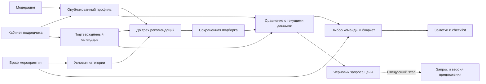

# Экосистема Event Match: от рекомендации к плану события

Исследование и реализация: 23 сентября 2026 года. Аналоги разобраны по официальным публичным страницам; их описания не являются проверкой реального кабинета, API или доступности в Казахстане. Исходный PDF хакатона используется как контекст: ядро продукта — до трёх объяснимых рекомендаций с честной обработкой занятости и пустого результата.

## Что показывает рынок

| Принцип | Наблюдение | Решение для Event Match |
| --- | --- | --- |
| Общий контекст события | [Cvent](https://www.cvent.com/en/event-marketing-management/cvent-supplier-network) позволяет повторно использовать критерии RFP и сравнивать ответы | `ClientEvent` связывает условия категории, подборки и план |
| Переход от выбора к уточнению | [GigSalad](https://help.gigsalad.com/article/39-getting-quotes) различает цену предложения, состав услуги, срок и условия | Из кандидата формируется черновик запроса с вопросами о полной цене и услугах |
| Планирование рядом с каталогом | [The Knot](https://www.theknot.com/wedding-checklist) связывает поиск с задачами подготовки | Выбор команды, общий бюджет и личный checklist на одном экране |
| Цена имеет единицу и состав | [Tagvenue](https://support.tagvenue.com/hc/en-gb/articles/360018256258-How-do-I-add-my-prices-and-opening-hours) поддерживает разные модели тарифа | Сейчас сумма только цен «от» за мероприятие; пакеты/часы/гости требуют отдельной модели |
| Повторное использование данных | [HoneyBook](https://help.honeybook.com/en/articles/5776807-the-differences-between-smart-files-and-legacy-files) связывает данные проекта и выбранные услуги с документами | Бриф запроса строится из сохранённых условий без повторного ввода |

Подробные доказательства и ограничения: [прямые маркетплейсы](research/event-marketplaces.md), [платформы рабочих процессов](research/workflow-platforms.md). Машиночитаемая карта источников, функций, данных и зависимостей: [feature-ecosystem.json](research/feature-ecosystem.json). Приоритеты ниже — наше продуктовое решение, а не измеренная эффективность конкурентов.

## Связи функций и данных



| Слой | Состояние в коде | Назначение |
| --- | --- | --- |
| Каталог, модерация, календарь, аккаунты | Существовал до этой работы | Источник текущих опубликованных услуг и доступности |
| Подбор, мероприятия, избранное, подборки | Существовал до этой работы | Формулировка потребности и история рекомендаций |
| Сравнение, план команды, общий бюджет | Добавлен этой работой | Выбор одной альтернативы на категорию с актуализацией данных |
| Черновик обращения, checklist, заметки | Добавлен этой работой | Следующий понятный шаг и личный контекст подготовки |
| Входящие заявки, предложения, бронь, отзывы | План развития | Требуют двустороннего процесса и новых подтверждённых данных |

## Реализованный сценарий

В кабинете заказчика открыть **Мои мероприятия**, создать событие и сохранить подборки по нужным категориям. Затем выбрать **План команды и бюджета** либо пункт **План события**. Ссылка на конкретное событие: `/client/planner?event=<eventId>`.

План показывает до трёх кандидатов каждой сохранённой подборки, начальную и текущую цену, соответствие условиям и текущую доступность. Можно выбрать одного подрядчика на категорию, заменить или убрать выбор, задать общий бюджет, сохранить заметки и личные отметки checklist. Повторное открытие загружает сохранённые решения. Редактируемый черновик обращения можно скопировать; копирование ничего не отправляет подрядчику.

Правила интерпретации:

- Бюджет в подборке — лимит одной категории. Общий бюджет плана вводится отдельно.
- В сумму включаются только выбранные актуальные кандидаты. Все три альтернативы не складываются.
- Один подрядчик не выбирается дважды на разные категории: каталог не содержит раздельной цены его услуг.
- Итог обозначается как цена «от», поскольку доплаты и состав пакета неизвестны. Остаток бюджета — только ориентир после стартовых цен.
- Занятость, неподтверждённый/устаревший календарь, снятая публикация, изменение брифа или несоответствие условиям блокируют новый выбор. Уже сохранённое проблемное решение остаётся заметным и требует пересмотра.
- Если выбранная позиция не разрешается в актуальные данные, полный остаток бюджета не вычисляется. Неизвестная цена не считается нулём.
- Checklist — личные заметки клиента, а не подтверждения подрядчика. Выбор в план не бронирует дату.
- Объяснение сохранённой рекомендации относится к моменту её получения; текущие факты проверяются отдельно. Свободные пожелания в live-подборе пока не влияют на ранжирование.

## Хранение и права

Новый модуль: `apps/event_match/lib/features/planning/`. Чистый `EventPlanEngine` работает без сети и получает время явно; `EventPlanRepository` отделяет интерфейс от Firestore. Общий `WorkspaceRepository` сохранён без новых абстрактных методов.

Приватный документ: `accounts/{uid}/eventPlans/{eventId}`.

| Поле | Смысл |
| --- | --- |
| `schemaVersion: 1` | Версия схемы |
| `totalBudgetKzt: int/null` | Общий ориентир от 1 до 1 000 000 000 ₸ либо не задан |
| `choices: map` | Категория → `selectionId`, `contractorId`; максимум 10 категорий |
| `completedTaskIds: list` | Личные отметки: состав услуг, полная цена, условия |
| `notes: string` | До 2000 символов личного контекста |
| `revision: int` | Версия документа для защиты от перезаписи чужой вкладкой |
| `updatedAt: timestamp` | Серверное время записи |

Правила разрешают доступ только владельцу активного аккаунта с подтверждённой почтой, включая запрет чтения чужого плана администратором. Для записи требуется существующее мероприятие; проверяются поля, типы, размеры, категории и последовательная версия. Транзакция сравнивает загруженную версию с серверной и возвращает конфликт вместо незаметной перезаписи.

В плане хранятся ссылки, а не копии контактов. Правила Firestore ограничивают форму ссылок и доступ к документу; принадлежность кандидата конкретной подборке и пригодность к выбору проверяет движок. Поэтому ручная подмена ссылок не должна создавать готовую позицию или нулевую стоимость. Это персональный план, не серверная авторизация брони.

Удаление мероприятия через приложение удаляет его план в одной пакетной операции; существующее ограничение требует сначала удалить подборки. Служебное рекурсивное удаление аккаунта включает `eventPlans`; dry-run показывает их количество. Пропавшие профили и подборки перестают разрешаться в пригодных кандидатов.

## Следующие этапы

| Приоритет | Функция | Нужные данные и зависимости | Приёмочный результат |
| --- | --- | --- | --- |
| P1 | Структурированные запросы и ответы | `ServiceRequest`, участники, снимок брифа, статусы, идемпотентность | Подрядчик отвечает только на свой запрос, клиент видит историю |
| P1 | Сравнение коммерческих предложений | `Quote`, цена целиком, включения/исключения, срок, версия | Сравниваются одинаковые условия; старое предложение нельзя принять |
| P1 | Пакеты и параметры категории | Модель тарифа, гости/вместимость для залов, часы для людей | Стоимость корректно пересчитывается, неизвестное остаётся неизвестным |
| P2 | Совместное планирование | Явные участники, роли, приглашения, журнал изменений | Коллега видит только приглашённое событие и разрешённые поля |
| P2 | Бронирование и отмена | Подтверждение обеих сторон, конфликт дат, условия, переходы | Две заявки не получают одну и ту же подтверждённую дату |
| P2 | Отзывы после услуги | Связь с завершённым заказом и автором | Отзыв отделён от полноты/модерации профиля |
| P3 | Аналитика и улучшение подбора | Согласованная событийная аналитика, реальные исходы, согласия | Измеряются этапы воронки; нет «рейтингов надёжности» из синтетики |

Платежи, договоры, уведомления и зарубежные интеграции требуют отдельного продуктового решения. Приведённые сервисы служат источниками паттернов; подключение их API не выполнялось.

## Проверка и запуск

```sh
cd apps/event_match
flutter analyze
flutter test
flutter build web
```

Из `backend/`: `npm test` проверяет Firestore Rules в локальных Auth/Firestore эмуляторах, включая новую коллекцию. Для запуска против Firebase необходимы новые правила из репозитория; в этой работе production-деплой не выполняется. Для локальной разработки см. [настройку Firebase](firebase.md).

Ключевые сценарии приёмки: изменение выбранной альтернативы меняет смету; пропавшая позиция делает расчёт неполным; дата/город/формат события инвалидируют старое сравнение; busy/unknown не выбираются; ошибка записи сохраняет черновик; конкурирующая версия не перезаписывается; чужой пользователь не читает план; интерфейс работает на узком экране и с увеличенным текстом.

Результаты проверки согласованного рабочего дерева 23.09.2026:

| Проверка | Результат |
| --- | --- |
| `flutter analyze` | Без замечаний |
| `flutter test` | 125 прошли; 6 необязательных визуальных сценариев пропущены по флагам |
| Firestore/Auth Emulator | 38 прошли, включая 12 сценариев `eventPlans` |
| Планировщик с `PLAN_VISUAL_PREVIEW=true` | 17 прошли; PNG 375/1440 px просмотрены вручную |
| Deep link через вход | Сохраняется выбранное событие из query-параметра |
| `flutter build web` | Сборка успешна, артефакт `apps/event_match/build/web` |

Визуальные тесты проверяют также масштаб текста 1.8 и альбомную ориентацию. Файлы изображений используют тестовые профили и системный шрифт только в тестовом процессе. Рабочий Firebase не обновлялся.
