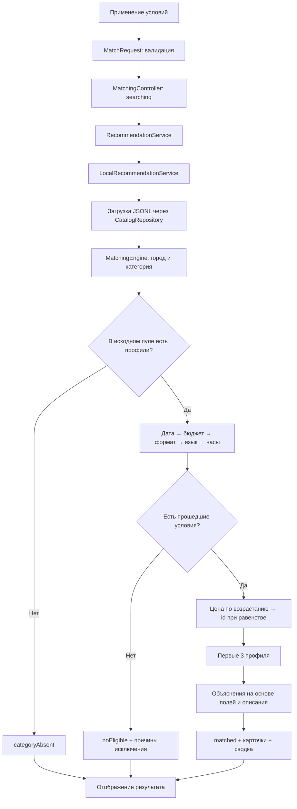

# Event Match — технический пайплайн

Сервис принимает условия события и возвращает до трёх подрядчиков с конкретными объяснениями выбора. Ниже описана текущая реализация; будущий AI-этап выделен отдельно.

## 1. Подготовка данных

```text
CSV организаторов: 66 профилей
    → scripts/import_catalog.py
    → проверка обязательных полей, уникальности id, цен, часов и дат
    → преобразование списков, флагов и пустых часов
    → assets/data/catalog.jsonl
    → AssetCatalogRepository
    → List<Contractor>
```

Исходный файл сохранён в `data/catalog.csv`. Поля со списками разделены `|`; пустое `max_hours` превращается в `null`. Сохраняются флаги `synthetic`, `city_imputed`, `price_imputed`. В каталоге 13 синтетических профилей организаторов; собственные демоданные используются только в тестах.

## 2. Действия пользователя

1. Пользователь открывает приложение и видит заполненный каталог. Карточки показываются по 12 с кнопкой «Показать ещё». Это просмотр каталога, доступность на дату ещё не проверена.
2. Нажимает «Подобрать под событие». На компьютере открывается правая панель, на телефоне — полноэкранная форма.
3. Заполняет условия и нажимает «Применить и подобрать».
4. Форма проверяет значения. При ошибке остаётся открытой; при успехе закрывается и передаёт `MatchRequest` контроллеру.
5. Пользователь получает до трёх карточек либо объяснение отсутствия результата. Применённые условия остаются над выдачей.
6. «Изменить фильтры» открывает копию применённых условий. Закрытие без применения отбрасывает изменения; сброс возвращает каталог.

## 3. Параметры заказа

| Параметр | Обязательный | Назначение |
| --- | --- | --- |
| Город | Да | Выбрать локальный каталог |
| Категория подрядчика | Да | Определить, кого ищем |
| Формат события | Да | Проверить, берёт ли подрядчик этот формат |
| Дата | Да | Исключить занятых; окно 23.09–31.12.2026 |
| Бюджет, ₸ | Да | Ограничить стартовую цену одного подрядчика |
| Длительность, ч | Нет | Проверить максимальное время работы |
| Язык | Нет | Проверить язык работы |
| Текстовые пожелания | Нет | Передаются в запросе; пока не влияют на локальный подбор |

Числовые параметры должны быть положительными; бюджет — целым числом, длительность — конечным числом. Пожелания ограничены 1000 символами. Проверки есть в форме и на границе домена.

## 4. Выполнение подбора



### Жёсткие условия

Сначала отбираются точные совпадения города и категории. Для каждого профиля из этого пула последовательно проверяются:

1. Дата отсутствует в `busy_dates`.
2. `price_from_kzt` не превышает бюджет.
3. `event_formats` содержит выбранный формат.
4. `languages` содержит выбранный язык, если он задан.
5. `max_hours` не меньше запрошенной длительности, если оба значения заданы.

`max_hours: null` означает работу без привязки к часам присутствия. Банкетные залы проходят те же проверки даты, что и остальные категории.

В сводке учитывается первая причина исключения каждого профиля. Поэтому один подрядчик не попадает одновременно в несколько счётчиков. Это не полный перечень всех нарушенных условий.

### Порядок и объяснение

Прошедшие фильтры профили сортируются по стартовой цене, затем по `id`. Берутся первые три. При неизменном каталоге одинаковый запрос даёт одинаковый порядок.

Это текущий базовый алгоритм, не AI-рейтинг качества. Объяснение перечисляет подтверждённые совпадения: дата, формат, стартовая цена, при необходимости язык и часы. Затем добавляется короткая цитата из описания; полное описание раскрывается в карточке. Стартовая цена не гарантирует итоговую стоимость заказа.

## 5. Результаты и ошибки

| Состояние | Что означает | Что видит пользователь |
| --- | --- | --- |
| `matched` | Есть подходящие профили | До 3 карточек, объяснения, число подходящих и причины исключения остальных |
| `categoryAbsent` | Нет категории в выбранном городе | Сообщение об отсутствии категории и изменение условий |
| `noEligible` | Профили есть, но все исключены | Причины отказа и изменение условий |
| Ошибка загрузки каталога | Источник не удалось прочитать | Сообщение и повторная загрузка |
| Ошибка/таймаут подбора | Сервис не вернул результат | Сообщение и повторный подбор |

Если подходящих меньше трёх, показываются только существующие варианты. Недостающие карточки не дополняются случайными или занятыми подрядчиками.

Контроллер использует состояния `idle → searching → success / failure`. Таймаут ожидания — 10 секунд. Номер запроса защищает от позднего ответа: после нового подбора, сброса или закрытия экрана старый результат не применяется. Редактирование черновика в открытой панели не меняет текущую подборку до применения.

## 6. Пример на данных организаторов

Условия: Алматы, Ведущий, свадьба, бюджет 1 000 000 ₸, без дополнительных ограничений.

| Дата | Результат в порядке выдачи |
| --- | --- |
| 10.10.2026 | Сон Гоку, Хаул |
| 14.11.2026 | Мицури Канроджи, Эмилия, Сон Гоку |

Смена даты меняет доступность и состав выдачи. В сводке видно количество исключённых по занятости.

## 7. Будущий этап с AI — ещё не реализован

```text
Flutter: подтверждённые условия + пожелания
    → ApiRecommendationService
    → сервер POST /v1/recommendations
    → жёсткие фильтры по структурированным данным
    → смысловое сопоставление пожеланий и описаний
    → стабильное ранжирование и выбор до 3 кандидатов
    → LLM формулирует объяснение по переданным фактам
    → проверка ответа / фактическое объяснение при сбое LLM
    → кэш результата с версиями данных и алгоритма
    → карточки Flutter
```

Ключ модели хранится на сервере. LLM не определяет занятость, не меняет цены и не добавляет профили вне исходного пула. Для стабильного порядка используются фиксированные правила ранжирования и `id`; один только `temperature=0` не обеспечивает детерминизм.

Дополнительный будущий способ ввода: фраза пользователя → разбор моделью → черновик той же формы → подтверждение параметров пользователем → основной пайплайн. Недостающие дату и бюджет требуется уточнять.

Сейчас работают локальный JSONL, фильтры, стабильная сортировка и шаблонные объяснения. Сервера, эмбеддингов, LLM и хранения истории заказов пока нет.

## 8. Где находится реализация

Пути относительно `apps/event_match/lib/features/matching/`:

| Этап | Файл |
| --- | --- |
| Форма и черновик условий | `presentation/widgets/order_filters.dart` |
| Каталог, панель и выдача | `presentation/matching_screen.dart` |
| Карточка подрядчика | `presentation/widgets/contractor_card.dart` |
| Состояние и защита от поздних ответов | `presentation/matching_controller.dart` |
| Запрос, модели, валидация | `domain/models.dart` |
| Интерфейс сервиса | `domain/recommendation_service.dart` |
| Локальное выполнение | `data/local_recommendation_service.dart` |
| Загрузка каталога | `data/catalog_repository.dart` |
| Фильтрация, сортировка, объяснения | `domain/matching_engine.dart` |

Смежные документы: [архитектура](architecture.md), [развитие и контракт API](development.md).
