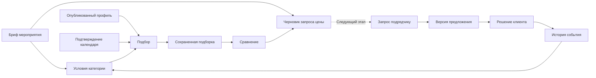

# Рабочий процесс подбора: HoneyBook, Thumbtack и Cvent

Дата проверки официальных источников: **23 сентября 2026 года**. Исследование для Event Match — Flutter/Firebase-приложения подбора event-подрядчиков в Казахстане. Факты ниже относятся к публичному описанию продуктов; рекомендации и схема данных — наши предложения. Доступность этих сервисов в Казахстане, локальные платежи, цены тарифов и доступ к API этим исследованием не установлены.

## Что подтверждено у похожих продуктов

| Продукт | Подтвержденные возможности | Как повторно используются данные | Применимый принцип |
| --- | --- | --- | --- |
| HoneyBook | Smart files объединяют анкету, выбор услуг, договор, оплату и запись на встречу. Есть повторно используемые шаблоны и документы конкретного проекта. В мобильном редакторе доступен ограниченный набор блоков; некоторые блоки добавляются через созданный на вебе шаблон. [Официальная инструкция](https://help.honeybook.com/en/articles/5259476-create-build-and-elevate-smart-files-in-honeybook). | Ответы анкеты связываются с полями проекта, выбранные услуги подставляются в счет и договор. [Сравнение типов файлов](https://help.honeybook.com/en/articles/5776807-the-differences-between-smart-files-and-legacy-files). Клиентский портал показывает общие файлы, сообщения и разрешенные к показу данные проекта. [Возможности портала](https://help.honeybook.com/en/articles/6428603-what-clients-can-see-and-do-in-the-client-portal). | Бриф мероприятия должен заполняться один раз и сопровождать подбор и дальнейший запрос цены. |
| Thumbtack | Описан последовательный путь: просмотр профилей и проверенных отзывов, обсуждение проекта и цен с исполнителем, выбор и бронирование в приложении. [How it works](https://www.thumbtack.com/how-it-works). | Публичная страница подтверждает связность пути поиска и общения, но не раскрывает техническую модель данных или переносимость запроса между исполнителями. | После рекомендации нужен понятный следующий шаг. Профиль и стартовая цена помогают начать разговор, но сами по себе не завершают заказ. |
| Cvent Supplier Network | Один RFP отправляется нескольким площадкам; ответы сравниваются рядом; критерии можно сохранять и клонировать. Есть история запросов, расходов и предпочитаемые площадки. В enterprise-предложении отдельно указаны организационные шаблоны и вопросы. [Страница продукта](https://www.cvent.com/en/event-marketing-management/cvent-supplier-network). | Один набор условий служит основой запросов нескольким поставщикам и дальнейших сравнений; история используется для следующих мероприятий. | Сравнивать поставщиков относительно одного брифа и одной категории, сохраняя условия сравнения. |
| Cvent Vendor Marketplace, powered by Reposite | Проект объединяет RFP, предложения и коммуникацию. В описании указаны рекомендации по городу, датам, размеру группы, бюджету и типу мероприятия, сравнение цены, состава и условий предложений, повторно используемые RFP. [Страница продукта и FAQ](https://www.cvent.com/en/event-marketing-management/vendor-marketplace). | Детали мероприятия используются при поиске поставщиков нескольких категорий; предложения и связанные документы остаются внутри проекта. | Общий объект мероприятия связывает потребности по категориям, подборки и ответы. |

HoneyBook здесь — ориентир для работы конкретного подрядчика с клиентом, Thumbtack — для перехода от поиска к контакту, Cvent — наиболее близкий ориентир для закупки услуг под одно мероприятие. Это сравнение продуктовых механизмов, а не рейтинг доступных в Казахстане сервисов.

## На что уже можно опереться в Event Match

Проверены текущие исходники, а не только README: описание в README отстает от уже присутствующих рабочих кабинетов.

| Основа в репозитории | Что уже есть | Значение для развития |
| --- | --- | --- |
| `apps/event_match/lib/features/workspace/domain/workspace_models.dart` | `ClientEvent`: название, город, дата, формат, пожелания. `SavedSelection`: ссылка на мероприятие, `MatchRequest`, снимки рекомендованных подрядчиков, дата сохранения. | Можно связать бриф и сравнение без повторного ввода общих условий. |
| `apps/event_match/lib/features/workspace/domain/workspace_repository.dart` | События, подборки, избранное, профиль подрядчика, модерация, календарь. | Есть граница доступа к данным; сущностей запроса цены, ответа и бронирования пока нет. |
| `apps/event_match/lib/features/workspace/data/firestore_workspace_repository.dart` | Firestore сохраняет подборку со снимками. Разрешается до трех живых профилей. | Сравнение естественно ограничить тремя кандидатами, сохранив текущую модель. |
| `apps/event_match/lib/features/workspace/presentation/client_page.dart` | Обнаруживаются изменения события, стартовой цены, публикации профиля и доступности после сохранения подборки. | Предупреждения об устаревании нужно сохранить в сравнении и черновике запроса. |
| `CalendarMonth` в модели кабинета | Есть занятые дни и `confirmedAt`; сведения считаются свежими менее 30 дней, иначе доступность не подтверждена. | Календарь — проверяемое свидетельство, а не гарантия или бронь. |

## Предложение: небольшой связанный набор функций

### Первый законченный этап

**Бриф → сохраненная подборка → сравнение → черновик запроса цены.** Этот этап можно показать и использовать на существующих данных, не выдавая стартовую цену за согласованную стоимость.

1. **Сравнение до трех подрядчиков из одной подборки.** Единые строки: стартовая цена в ₸, язык, формат, максимальная длительность, статус даты, описание, портфолио. Отсутствующие данные показываются как «не указано». Подтверждение цены и доступности — отдельные строки, не вычисленный рейтинг надежности. На телефоне сохраняется возможность сравнить одинаковые поля без очень широкой таблицы.
2. **Персональный черновик запроса.** Из `ClientEvent`, `MatchRequest` и выбранного профиля собирается редактируемый текст: дата, город, формат, категория, часы, язык, бюджет категории, пожелания; затем вопросы о полной цене, включенных услугах и возможности работать в эту дату. Кнопка копирует текст. В этом этапе копирование не меняет статус на «отправлено» и не создает бронь.
3. **Повторное использование условий.** «Повторить подбор» использует существующие условия, но просит актуальную дату и заново проверяет опубликованные профили. Нельзя молча переносить старую доступность на новое событие.

Эти функции используют принципы Cvent и HoneyBook, но являются нашим предложением, а не заявлением о полной функциональной эквивалентности. На первом этапе достаточно существующих `SavedSelection` и `MatchRequest`; новую коллекцию ради временного текста создавать не обязательно.

### Следующий этап после первого

**Запрос → входящие подрядчика → структурированный ответ → решение клиента.** Для этого уже нужна новая общая серверная модель и проверка прав; хранение только в `accounts/{clientUid}` не даст подрядчику безопасный доступ без явных правил.

| Объект, предлагаемый нами | Ключевые поля | Кто изменяет | Связь |
| --- | --- | --- | --- |
| `ServiceRequest` | `clientId`, `contractorId`, `eventId`, `selectionId`, `briefSnapshot`, `profileRevision`, `status`, `revision`, `createdAt`, `expiresAt` | Клиент создает и отменяет; получатель отмечает просмотр; допустимые переходы проверяются сервером | Один выбранный подрядчик и одна категория. Снимок фиксирует согласуемые условия. |
| `Quote` | `requestId`, `contractorId`, `totalKzt`, `inclusions`, `exclusions`, `durationHours`, `availabilityConfirmedAt`, `validUntil`, `revision` | Только соответствующий подрядчик создает новую версию ответа | Полная цена относится к конкретным условиям и не перезаписывает публичную цену «от». |
| `Decision` | `quoteId`, `quoteRevision`, `clientId`, `status`, `createdAt` | Клиент фиксирует выбор конкретной версии | Выбор клиентом не равен подтвержденной брони. |
| `Booking` — позднее | `requestId`, `quoteId`, `date`, `confirmation`, `status`, `revision` | Согласованные переходы обеих сторон | Отдельный жизненный цикл, требующий защиты от двойного подтверждения. |

Предлагаемые статусы запроса: `draft → sent → viewed → quoted`, с отдельными `declined`, `cancelled`, `expired`. Для повторного нажатия «отправить» нужен стабильный идентификатор операции; для изменения брифа после отправки — новая версия и явный сигнал о необходимости повторного ответа. Это проектное решение Event Match, не восстановленная внутренняя архитектура конкурентов.

## Что делает набор экосистемой данных

Преимущество — непрерывность контекста: подрядчик отвечает на те же условия, по которым его выбрали; клиент сравнивает предложения с одинаковой структурой; следующее мероприятие начинается с предыдущих условий, но свежие цены и доступность проверяются заново. Идентификаторы связывают сущности, а снимки сохраняют историю обещаний.

## Ограничения и проверка результата

- Синтетические и восстановленные поля исходного каталога нельзя превращать в подтвержденные отзывы, цены оффера или реальные ответы подрядчика. Существующее ограничение сохранения на живые профили стоит сохранить.
- Свободная дата означает только заявленную доступность на момент проверки. Чужой маркетинговый термин «instant booking» не обосновывает такую гарантию в Event Match.
- У выбранных официальных источников не проверены API, доступность платежей в Казахстане и условия локального использования. Предлагаем собственный процесс на текущем стеке; интеграции требуют отдельной проверки.
- Бюджет `MatchRequest` относится к категории. Его нельзя суммировать со стартовыми ценами и называть итоговым бюджетом мероприятия без данных о составе услуг и пересечении пакетов.
- Для совместных запросов сервер должен проверять участника, автора цены, допустимый переход статуса и актуальную версию. Полный бриф не должен становиться публичным вместе с каталогом.
- Полезные приемочные сценарии первого этапа: сравнение одного/трех кандидатов; неизвестная доступность; изменение цены после сохранения; снятый с публикации профиль; пустые необязательные поля; точное копирование брифа без фиктивного статуса отправки; актуализация даты при повторе.

Успех первого этапа измеряется не числом новых экранов: пользователь должен из сохраненной подборки подготовить одинаково полный запрос двум подходящим подрядчикам без повторного набора условий. Позднее можно измерять долю запросов со структурированным ответом, время до ответа и долю принятых предложений; эти метрики пока являются предложением, а не собранными показателями.
